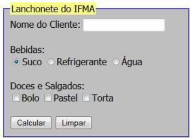

# Laboratório Javascript
Resolução da atividade Laboratório Javascript da disciplina de Autoria Web

Questão/Função:

1.  Lê o código do item pedido, a quantidade e calcula o valor a ser pago por aquele lanche.
  
    - Cardápio
<pre>
  | Especificação     | Código  | Preço   | 
  ----------------------------------------- 
  | Cachorro quente   | 100     | 1,20    | 
  | Bauru simples     | 101     | 1,30    | 
  | Bauru com ovo     | 102     | 1,50    | 
  | Hamburguer        | 103     | 1,20    | 
  | Cheeseburguer     | 104     | 1,30    | 
  | Refrigerante      | 105     | 1,00    | 
</pre>
  
2.  Lê dois números e imprime em uma tabela (gerada dinamicamente) o resultado das operações aritméticas soma, produto, divisão e resto da divisão (%) entre esses números.

3.  Recebe uma data no formato “dd/mm/aaaa” e escreve a data por extenso.

4.  Formulário
    - Molde:
    
    </img>
    
  - Ao clicar no botão [Calcular] será gerada uma mensagem na página com as informações de nome do cliente, qual(is) bebida(s) que ele consumiu e qual(is) doce(s) e/ou salgado(s) consumiu. 
  - Informa também o valor a pagar.  
  - Os produtos têm os seguintes valores: 
     Suco (5.00), Refrigerante (4.50), Água (1.50), Bolo (4.50), Pastel (5.00) e Torta (6.00).
     
5. Calculadora com as quatro operações básicas
